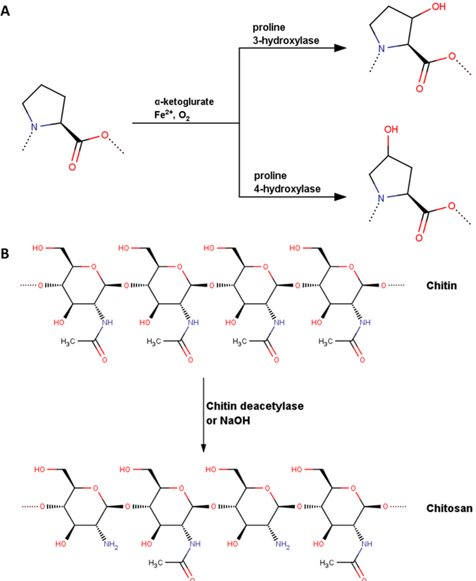

# Chitosan-Collagen_docking

Chitosan-collagen blends find extensive applications in tissue engineering, treating joint diseases, and various biomedical
disciplines. Understanding the interaction between chitosan and collagen type II is crucial for modulating mechanical
properties, crucial for designing biomaterials suitable for cartilage and synovial fluid regeneration. However, numerous
structural features influence chitosan's affinity for collagen, with the deacetylation degree (DD) of chitosan and the
hydroxylation degree (HD) of PRO moieties in collagen being among the most significant. This study employs a highly efficient
molecular dynamics approach to analyze combinations of both factors. Our findings reveal that modifications in DD and HD
significantly impact the structural characteristics of the complex, particularly concerning hydrogen bonds, hydrophobic
interactions, and ionic contacts. Both direct and indirect (water bridges) hydrogen bond contacts are examined. Remarkably, for
most collagen analogs, a strong correlation between binding free energy and DD is observed.


## Installation

1. Clone this repository to your local machine.
2. Ensure you have Python 3.x installed.
3. Install the required dependencies using pip:

    ```
    pip install pandas matplotlib numpy
    ```

## Usage

1. Ensure your data files are organized according to the specified structure.
2. Modify the file paths and parameters in the code as needed.
3. Run the `main` function to generate visualizations.

## File Structure

- **read_data.py**: Contains functions for reading, processing, and analyzing molecular dynamics data.
- **Files/**:
  - *Data files*: Contains the input data files for analysis.
  - *HBonds_vs_site.png*: Output visualization of hydrogen bond analysis.

## Contributions
Original paper contributors
Piotr Bełdowski, Maciej Przybyłek, Przemysław Raczynski, Andra Dedinaite, Krzysztof Górny,
Florian Wieland, Zbigniew Dendzik, Alina Sionkowska and Per M. Claesson
Project contributor
Paweł Kalicki
Contributions to this project are welcome. If you find any issues or have suggestions for improvements, please feel free to open an issue or submit a pull request.

## License

This project is licensed under the MIT License. See the [LICENSE](LICENSE) file for details.
