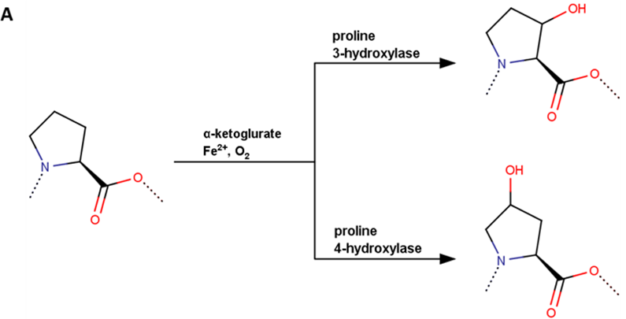
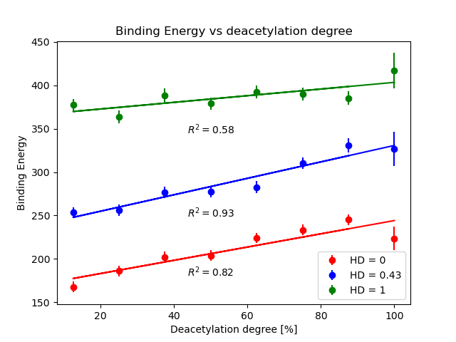

# Chitosan-Collagen_docking

Chitosan-collagen blends find extensive applications in tissue engineering, treating joint diseases, and various biomedical disciplines. Understanding the interaction between chitosan and collagen type II is crucial for modulating mechanical properties, crucial for designing biomaterials suitable for cartilage and synovial fluid regeneration. However, numerous structural features influence chitosan's affinity for collagen, with the deacetylation degree (DD) of chitosan and the hydroxylation degree (HD) of PRO moieties in collagen being among the most significant. This study employs a highly efficient molecular dynamics approach to analyze combinations of both factors. Our findings reveal that modifications in DD and HD significantly impact the structural characteristics of the complex, particularly concerning hydrogen bonds, hydrophobic interactions, and ionic contacts. Both direct and indirect (water bridges) hydrogen bond contacts are examined. Remarkably, for most collagen analogs, a strong correlation between binding free energy and DD is observed.


## Data description

In this investigation, the collagen II structure, denoted as (Pro-Hyp-Gly)3-Arg-Ala-Gly-Glu-Pro-Gly-Leu-
Gln-Gly-Pro-Ala-Gly-(Pro-Hyp-Gly)3, sourced from the protein data bank (PDB) under code
6JEC, was utilized. This structure features a common motif consisting of twelve amino acid residues, which is characteristic of human type II collagen. To ensure the stability of the triple-helical assembly, the peptide chains were terminated with (Pro-Hyp-Gly)3 triplets. Trans-4-Hydroxy-L-proline was selected for this study due to its prevalence in collagen.

The hydroxylation degree within the collagen chain was adjusted by introducing or removing OH groups from PRO
and HYP moieties. Peptide structures with varying hydroxylation degrees (HD) including 0, 6 (HD = 0.14), 12
(HD = 0.29), 18 (HD = 0.43, original structure), 24 (HD = 0.57), 30 (HD = 0.72), 36 (HD = 0.86), 
and 42 (HD =1) were considered. Table S1 in the Supplementary Information provides the positions of HYP/PRO residues for each of the ten variants corresponding to a given HD. Multiple randomly hydroxylated structures were generated
for each HD using MATLAB's built-in random number generator. This randomization of PRO/HYP positions aimed to
enhance the statistical significance of the results. A similar randomization approach was adopted for
deacetylation on chitosan, where five variations of each degree of deacetylation (DD) were prepared to account
for the randomization of acetyl group positions in chitosan of a given DD. Notably, while PRO hydroxylation at
position 3 is more significant in collagen IV than collagen II, 4-hydroxylation holds importance from the
perspective of collagen tertiary structure.

The subsequent phenomenon, chitosan deacetylation, was illustrated in Figure 1b. For this depiction, the chitin structure retrieved from the PubChem database (800 Da) was employed to construct chitosan structures characterized by DD ranging from 12.5% to 100%.

## Results 

The results obtained exhibit a level of intuitiveness and alignment with certain experimental findings documented in existing literature. The collagen structures employed in this study depict a segment of human collagen type II, featuring a tertiary structural arrangement and the presence of critical residues and fragments, notably the prevalent triplet PRO-HYP-GLY. Despite the relatively short nature of the utilized peptide helices, they appear to offer sufficient insight into how the ratio of HYP to PRO can impact chitosan's affinity for collagen. However, certain aspects warrant further exploration in subsequent studies, such as the influence of the quantity of individual residues on collagen's affinity for chitosan. This aspect seems particularly significant within the framework of collagen's polyelectrolytic nature.

### Binding Energy


### Hydrogen Bonds


### Hydrophobic Interactions


### Ionic Interactions

Ionic Interactions

## Description 

The script performs the following tasks:

1. **Data Extraction**: Reads data files (`bindenergy_Mg.tab`) to extract binding energy or interaction data for different hydroxylation degrees.
2. **Data Analysis**: Analyzes the extracted data to calculate averages, standard deviations, and R2 values for each set of values.
3. **Visualization**: Generates plots depicting the relationship between interaction type and deacetylation degree, along with linear regression lines and R2 values.

## Installation

1. Clone this repository to your local machine.
2. Ensure you have Python 3.x installed.
3. Install the required dependencies using pip:

    ```
    pip install -r requirements.txt
    ```

## Usage

1. Ensure your data files are organized according to the specified structure.
2. Modify the file paths and parameters in the code as needed.
3. Run the `main` function to generate visualizations.

## File Structure

- **read_data.py**: Contains functions for reading, processing, and analyzing molecular dynamics data.
- **Files/**:
  - *Data files*: Contains the input data files for analysis.
  - *HBonds_vs_site.png*: Output visualization of hydrogen bond analysis.

## Contributions
Original paper contributors
Piotr Bełdowski, Maciej Przybyłek, Przemysław Raczynski, Andra Dedinaite, Krzysztof Górny,
Florian Wieland, Zbigniew Dendzik, Alina Sionkowska and Per M. Claesson
Project contributor
Paweł Kalicki
Contributions to this project are welcome. If you find any issues or have suggestions for improvements, please feel free to open an issue or submit a pull request.

## License

This project is licensed under the MIT License. See the (LICENSE) file for details.
